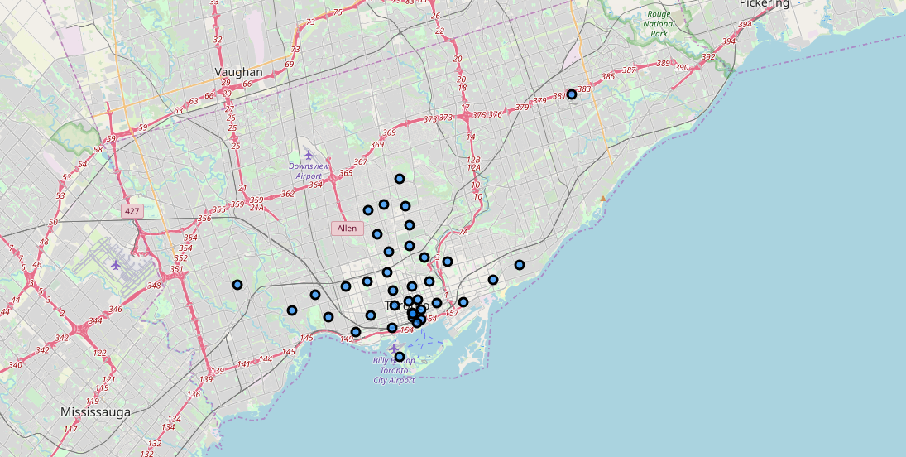
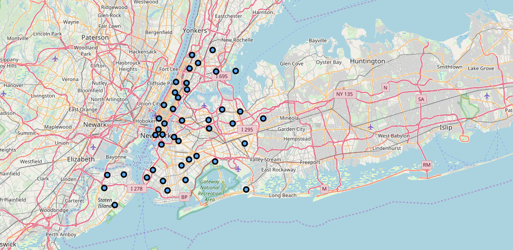
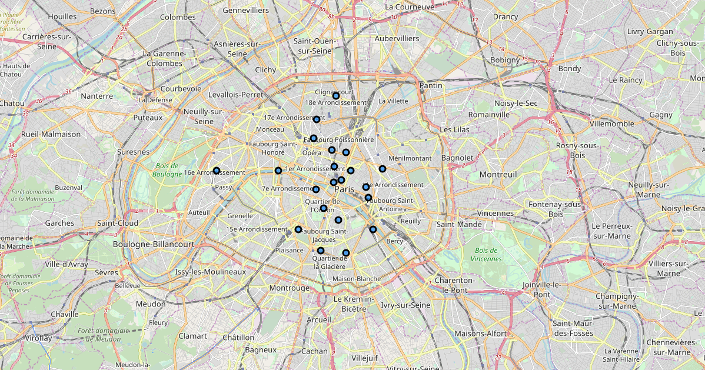
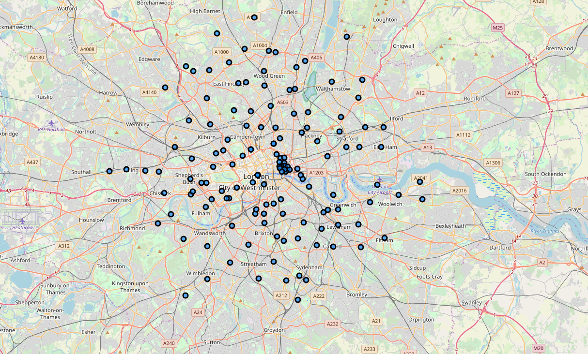

# Report Week 5

## Introduction

According to culture trip the most multicultural cities in the world are:

* Amsterdam
* London
* Los Angeles
* Paris
* New York City
* San Francisco
* São Paulo
* Singapure
* Sydney
* Toronto

The president of ONU needs to compare the neighborhoods of that cities to understand they are similar or not. In that case i'll compare New York City (used in Module 3), Toronto (used in Module 3), Paris and London.

## Data

1 - New York City Neighborhood names (https://www.health.ny.gov/statistics/cancer/registry/appendix/neighborhoods.htm)

2 - Toronto Neighborhood names (https://en.wikipedia.org/wiki/List_of_postal_codes_of_Canada:_M)

3 - Paris Neighborhood names (https://www.worldpostalcodes.org/en/france/arrondissement/map-of-postal-codes-in-paris)

4 - London Neighborhood names:
	* E area (https://en.wikipedia.org/wiki/E_postcode_area)
	* EC area (https://en.wikipedia.org/wiki/EC_postcode_area)
	* N area (https://en.wikipedia.org/wiki/N_postcode_area)
	* NW area (https://en.wikipedia.org/wiki/NW_postcode_area)
	* SE area (https://en.wikipedia.org/wiki/SE_postcode_area)
	* SW area (https://en.wikipedia.org/wiki/SW_postcode_area)
	* W area (https://en.wikipedia.org/wiki/W_postcode_area)
	* WC area (https://en.wikipedia.org/wiki/WC_postcode_area)

## Methodology

I adopted the methodology used in Toronto example.
First i used read_html to read datasource para convert them to a datraframe. After that i did the transformations before convert them in a folium map, which means, drop duplicates, add columns, apend columns, etc. After that i created the folium map for each city based on latitude in pgeocode.nominatim.

## Results

### Toronto

### New York

### Paris

### London

This are the results that appears to me after data transformation. London is the city that have more nrighborhoods and Toronto is the city that have more centralized. 
New York have the most near the river and Paris is the city that have the less.

## Discussion

After see that results, like i said on introduction, the president of ONU withdrew information that he needs. After compare the 4 cities, he concluded that the cities are diffeent.

## Conclusion

It was a cool project. I understand now better the concept of data transformation and data science. The course was amazing and i think that the know-how that i learned could be importance in my professional carreer.
Regarding of the project, i had no idea that the cities are so different.